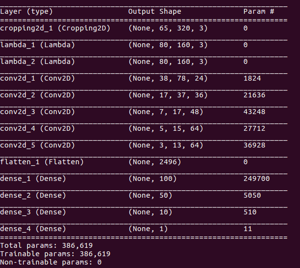
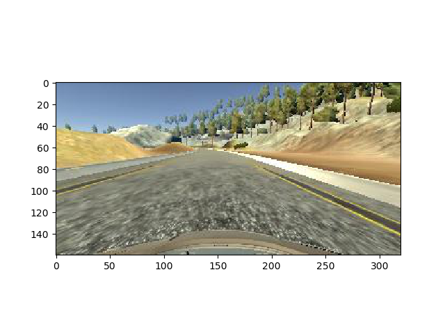
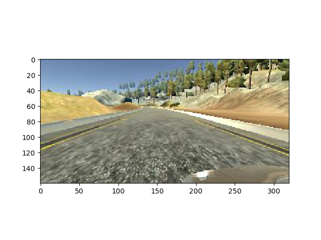
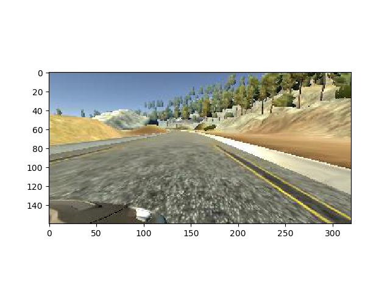
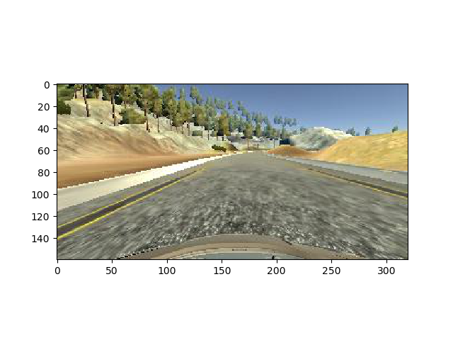
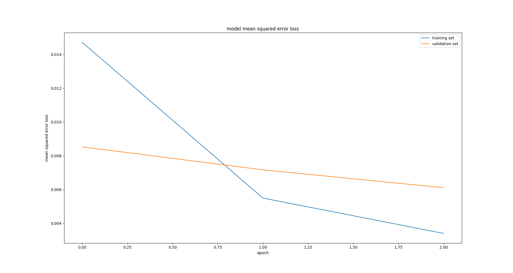

# **Behavioral Cloning**
---


## Goals
---
The goals / steps of this project are the following:
* Use the simulator to collect data of good driving behavior
* Build, a convolution neural network in Keras that predicts steering angles from images
* Train and validate the model with a training and validation set
* Test that the model successfully drives around track one without leaving the road
* Summarize the results with a written report

## Rubric Points
---

Here I will consider the [rubric points](https://review.udacity.com/#!/rubrics/432/view) individually and describe how I addressed each point in my implementation.  

### Files Submitted & Code Quality

#### 1. Submission includes all required files and can be used to run the simulator in autonomous mode

My project includes the following files:
* model.py containing the script to create and train the model
* drive.py for driving the car in autonomous mode
* model.h5 containing a trained convolution neural network
* writeup_report.md or writeup_report.pdf summarizing the results
* video_track1.mp4 is a low resolution video of the car driving a lap on track 1

#### 2. Submission includes functional code
Using the Udacity provided simulator and my drive.py file, the car can be driven autonomously around the track by executing
```sh
python drive.py model.h5 run1
```

The images of the run will be saved in run1.

#### 3. Submission code is usable and readable

The model.py file contains the code for training and saving the convolution neural network. The file shows the pipeline I used for training and validating the model, and it contains comments to explain how the code works.

### Model Architecture and Training Strategy
---
#### 1. An appropriate model architecture has been employed

I started with a simple logistic regression model and I could not get the car to stop swerving out of the road with this. A more complicated model was needed.

Having successfully used a modification of the the [Lenet](http://yann.lecun.com/exdb/publis/pdf/lecun-98.pdf) architecture for the traffic sign classifier, I tried that next. The car would drive successfully drive up to the turn right after the bridge. Even after using data sets capturing navigating just the turn after the bridge, the model had trouble making the turn. The implementation of

Next I used the [Nvidia](https://devblogs.nvidia.com/parallelforall/deep-learning-self-driving-cars/) architecture as suggested in the lectures. I was able to successfully train a model to drive track1 autonomously using this architecture.

#### 2. Attempts to reduce overfitting in the model

The model was run typically for 3-5 epochs to prevent overfitting. Did not feel the need to implement dropout. The validation accuracy and training accuracy were almost identical. I was ore concerned about not getting enough variety in the datasets.

I was concerned about the model overfitting around zero steering angle, just because there was a larger amount of data in this range. I tried to addressed this by adding this (lines 100-102 in  model.py):

```python
prob = np.random.random()   # generates a random number between 0 and 1
# drop steering angles less than 0.75 degrees with probability of 60%
if (prob < 0.6) and (abs(center_steering) < 0.75):
  continue;
```

I found that the model performed about the same even after removing this.

The model was trained on track1 by running CCW and CW directions to ensure that it has a good distribution of left and right turns

#### 3. Model parameter tuning

The model used an adam optimizer, so the learning rate was not tuned manually (model.py line 25).

Found that training 3-5 epochs was enough to prevent overfitting and to converge to the appropriate model weights. Ended up with 3 epochs.

Using a batch size of 128 in the generator seemed to produce the best result.

#### 4. Appropriate training data

It seems like appropriate training data is the key to the car driving track1 successfully.

Could not get it to work using the provided data in conjunction with driving data and recovery data collected using the simulator. The driving data that I collected initially had jerky movements with sharp corrections when the car veered of from the road center.

I started over by redoing the data collection. I paid special attention to ensure that the steering inputs were smooth and continuous. Even with a mouse the driving was noticeably better than my previous attempt. It is possible that better traning data may be obtained with a joystick.

For details about how I created the training data, see the next section.

### Model Architecture and Training Strategy
---

#### 1. Solution Design Approach

The overall strategy for deriving a model architecture was to start off with the basic Logistic regression and progressively make it more complex based on what has been demonstrated to work for this problem

After logistic regression, I tried [Lenet](http://yann.lecun.com/exdb/publis/pdf/lecun-98.pdf) architecture because I had used a variation of that successfully in the traffic sign classifier project.
This did pretty well for most of track, but failed on the turn after the bridge. Collecting extra data for that particular turn and some recovery data did not help fix the problem

I moved on to the [Nvidia](https://devblogs.nvidia.com/parallelforall/deep-learning-self-driving-cars/) architecture as suggested in the lectures. Various people in the forum discussions had reported success with this architecture.

I made a number of other tweaks to increase the amount of data available while turning. I used the center, left and right images, with steering angle correction applied to the left and right. After trying out various steering angle corrections I settled on a correction of 0.25 degrees

```python
CORRECTION = 0.25 # Steering correction applied to get the left and right steering angles (only center is provided)
left_steering = center_steering+CORRECTION  
right_steering = center_steering-CORRECTION
```

I also used the flipped images for center, left and right images by flipping the sign of the steering angle for the images

```python
center_image_flipped = np.fliplr(center_image) # flip the center image, to create mirror image data
center_steering_flipped = -center_steering #Flipped steering angle
```

A combination of these was the key to  for the vehicle to able to drive autonomously around track 1 without leaving the road.

#### 2. Final Model Architecture

- Input images: 160x320x3 (RGB image)

** Prepocess the images **
- Cropping 2D Layer: Cropping 70 pixels from the top and 20 from the bottom, 0 from the left and right
- Lambda layer: resize the image to 80x160
- Lambda layer: to normalize the image, pixel = (pixel/255)-0.5

** Nvidia architecture **
- convolution2D layer with depth of 24, filter size 5x5, stride 2x2, 'VALID' padding
- Relu Activation
- convolution2D layer with depth of 36, filter size 5x5, stride 5x5, 'VALID' padding
- Relu Activation
- convolution2D layer with depth of 48, filter size 3x3, stride 1x1, 'VALID' padding
- Relu Activation
- convolution2D layer with depth of 64, filter size 3x3, stride 1x1, 'VALID' padding
- Relu Activation
- convolution2D layer with depth of 64, filter size 3x3, stride 1x1, 'VALID' padding
- Relu Activation
- Flatten layer
- Fully connected layer with 100 nodes
- Fully connected layer with 50 nodes
- Fully connected layer with 10 nodes
- Fully connected layer with 1 nodes

The overall model summary is shown below:



This has been implemented in model.py in lines 201-210

#### 3. Creation of the Training Set & Training Process

To capture good driving behavior, I first recorded two laps on track one using center lane driving. Here is an example image of center lane driving:

__Center image__



** Steering angle = -0.009433962 **

To augment the data sat, I also used and left and right camera images

__Left camera image__



** Left steering angle (0.25 correction):  0.240566038 **

__right camera image__



** Right steering angle (0.25 correction): -0.259433962 **

I also used flipped images.

** Example of a center flipped image: **



** Steering angle = 0.009433962 **

After collection 2 runs of smooth CW driving behavior and 1 run of smooth CCW driving behavior, I had 33318 data points

I finally randomly shuffled the data set and put 20% of the data into a validation set.

I used this training data for training the model. The validation set helped determine if the model was over or under fitting. The ideal number of epochs was 3 as validation accuracy was not reducing after that and there was a risk of overfitting the training data.

** Mean Squared Error loss for the Training and Validation data sets **




 I used an adam optimizer so that manually training the learning rate wasn't necessary.
